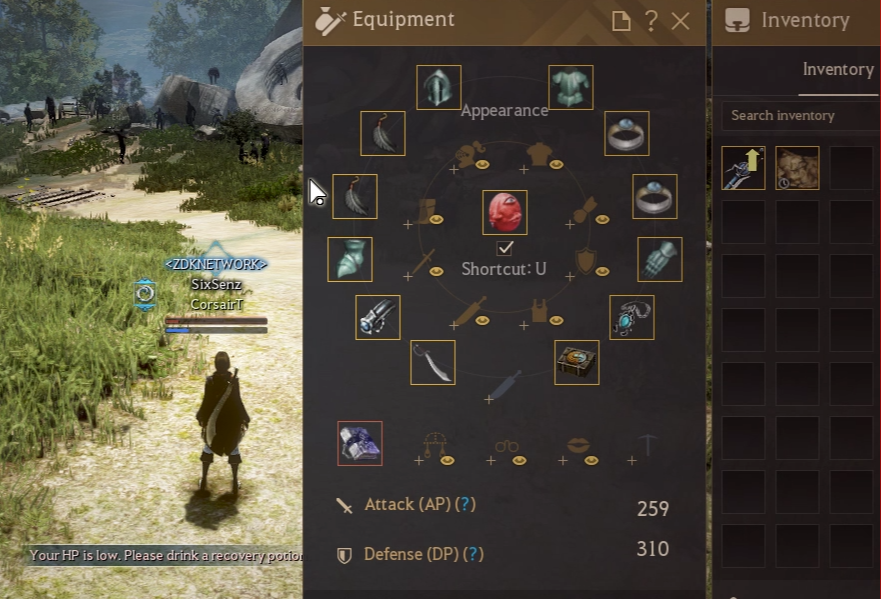
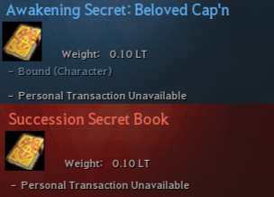
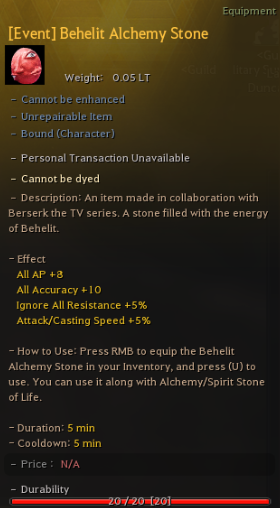
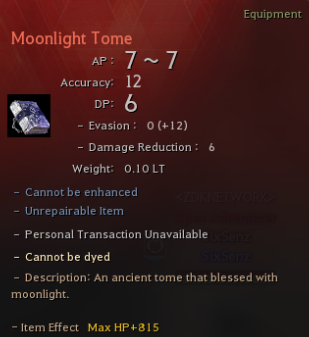
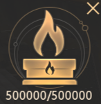
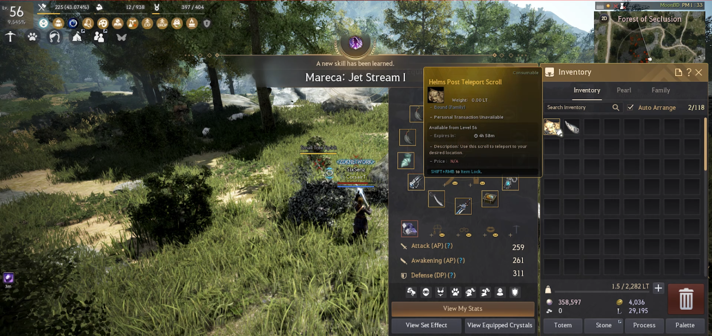
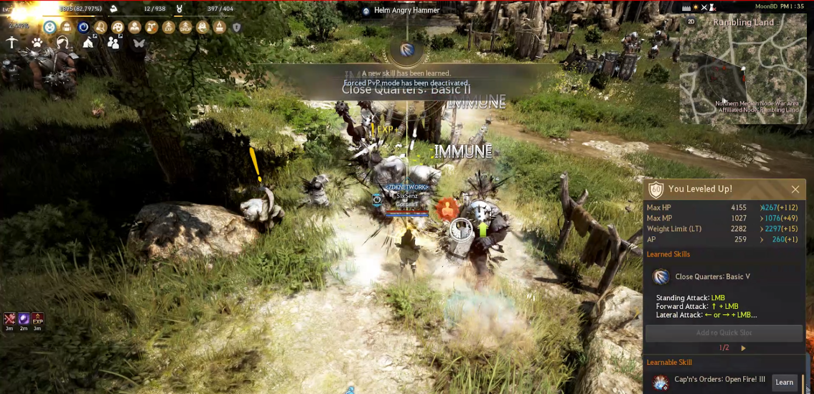

# Start You Adventure At MoonBD



## _What You Should Do in The **First 3 Minutes at MoonBD**_

<figure><figcaption>
<em><strong>Starting Equipment is Given Every Time You Create a New Character</strong></em>
</figcaption></figure>

<figure><figcaption>
<em><strong>Awakening and Succession Can Be Unlocked At Level 1 And Can Be Used After Level 56</strong></em>
</figcaption></figure>

<figure><figcaption>
<em><strong>Behelit Alchemy Stone</strong></em> <em><strong>(Can NOT be repaired)</strong></em>
</figcaption></figure>

<figure><figcaption>
<strong>Moonlight Tome Gives You All Adventure Log Stats So You Don't Need to Complete Adventure Logs Anymore!</strong>
</figcaption></figure>

__

<figure><figcaption>
<em><strong>500K Agris Fever For More Efficient Grind!</strong></em>
</figcaption></figure>

<figure><figcaption>
<em><strong>You can level up to 56 with gray foxes. After you reach level 56 use “Helms Post Teleport Scroll”</strong></em>
</figcaption></figure>

<figure><figcaption>
<em><strong>Helms Post gives lots of EXP&#x26;SP that you can max out all your skills and reach level 60 FAST!</strong></em>
</figcaption></figure>
