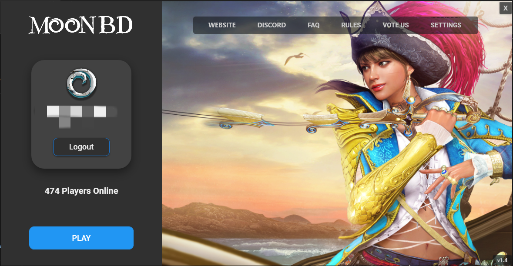
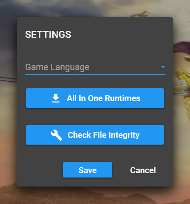

# ⬇ Installation


You must have [**.NET 6.0**](https://dotnet.microsoft.com/en-us/download/dotnet/6.0) installed on you pc in order to run the launcher.


### _1. Download MoonBD Launcher_

* Download the launcher from MoonBD discord #announcement channel.

### _**2. Install MoonBD Client**_

#### &#x20;    1. Click Setting

<figure><figcaption></figcaption></figure>

#### &#x20;    2. Download the Client by Check File Integrity

<figure><figcaption></figcaption></figure>

### 3. Troubleshooting

If your game crashes and having any problems follow these steps:

1. Clear Cache folder in game folder.
2. Delete MoonBDO Corsair in Documents (this will reset all of your settings).
3. Go to launcher settings and select your language again.
4. If you have font installed remove it.
5. Go to launcher settings click on Check File Integrity. Let it check and update missing/corrupt files.
6. Restarting your computer might help.

For any other errors you can check [**HERE**](../about/faq/common-errors-and-fixes.md). If none of these helped, please contact dev for [_**support**_](../about/informations/discord.md).
