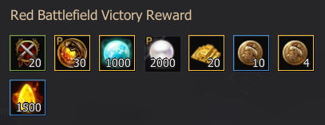
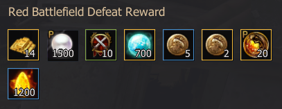
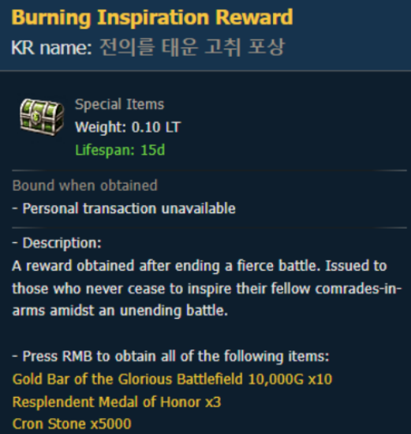
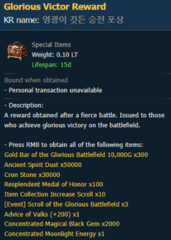
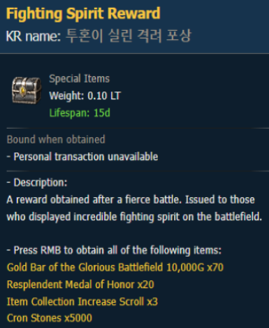

# Battle Rewards

__



<figure><figcaption>
<mark style="color:green;"><strong>Victory Reward</strong></mark>
</figcaption></figure>

<figure><figcaption>
<mark style="color:red;"><strong>Defeat Reward</strong></mark>
</figcaption></figure>



## _Tier 4 Nodes_

* <mark style="color:green;">**Win**</mark>: Burning Inspiration Reward x 5
* <mark style="color:red;">**Lose**</mark>: Burning Inspiration Reward x 4
* <mark style="color:orange;">**Draw**</mark>: Burning Inspiration Reward x 3
* <mark style="color:purple;">**MVP Player**</mark>: Burning Inspiration Reward x 5 + Win/Lose Reward

## _Tier 3 Nodes_

* <mark style="color:green;">**Win**</mark>: Burning Inspiration Reward x 4
* <mark style="color:red;">**Lose**</mark>: Burning Inspiration Reward x 3
* <mark style="color:orange;">**Draw**</mark>: Burning Inspiration Reward x 2
* <mark style="color:purple;">**MVP Player**</mark>: Burning Inspiration Reward x 4 + Win/Lose Reward

## _Tier 2 Nodes_

* <mark style="color:green;">**Win**</mark>: Burning Inspiration Reward x 3
* <mark style="color:red;">**Lose**</mark>: Burning Inspiration Reward x 2
* <mark style="color:orange;">**Draw**</mark>: Burning Inspiration Reward x 1
* <mark style="color:purple;">**MVP Player**</mark>: Burning Inspiration Reward x 2 + Win/Lose Reward

## _Tier 1 Nodes_

* <mark style="color:green;">**Win**</mark>: Burning Inspiration Reward x 2
* <mark style="color:red;">**Lose**</mark>: Burning Inspiration Reward x 1
* <mark style="color:orange;">**Draw**</mark>: Burning Inspiration Reward x 1
* <mark style="color:purple;">**MVP Player**</mark>: Burning Inspiration Reward x 1 + Win/Lose Reward

###

## Buring Inspiration Reward

| Reward Items                                 | Qty  |
| -------------------------------------------- | ---- |
| Gold Bar of the Glorious Battlefield 10,000G | 10   |
| Respiendent Medal of Honor                   | 3    |
| Cron Stone                                   | 5000 |

<figure><figcaption></figcaption></figure>



## _<mark style="color:green;">Victory</mark>_

* Glorious Victor Reward

| Reward Items                                 | Qty   |
| -------------------------------------------- | ----- |
| Gold Bar of the Glorious Battlefield 10,000G | 300   |
| Ancient Spirit Dust                          | 50000 |
| Cron Stone                                   | 30000 |
| Respiendent Medal of Honor                   | 100   |
| Item Collection Increase Scroll              | 10    |
| \[Event] Scroll of the Glorious Battlefield  | 3     |
| Advice of Valks (+200)                       | 1     |
| Concentrated Magical Black Gem               | 2000  |
| Concentrated Moonlight Energy                | 1     |

<figure><figcaption></figcaption></figure>

## _<mark style="color:red;">Defeat</mark>_

* Fighting Spirit Reward

| Reward Items                                 | Qty  |
| -------------------------------------------- | ---- |
| Gold Bar of the Glorious Battlefield 10,000G | 70   |
| Resplendent Medal of Honor                   | 20   |
| Item Collection Increase Scroll              | 3    |
| Cron Stone                                   | 5000 |

<figure><figcaption></figcaption></figure>


