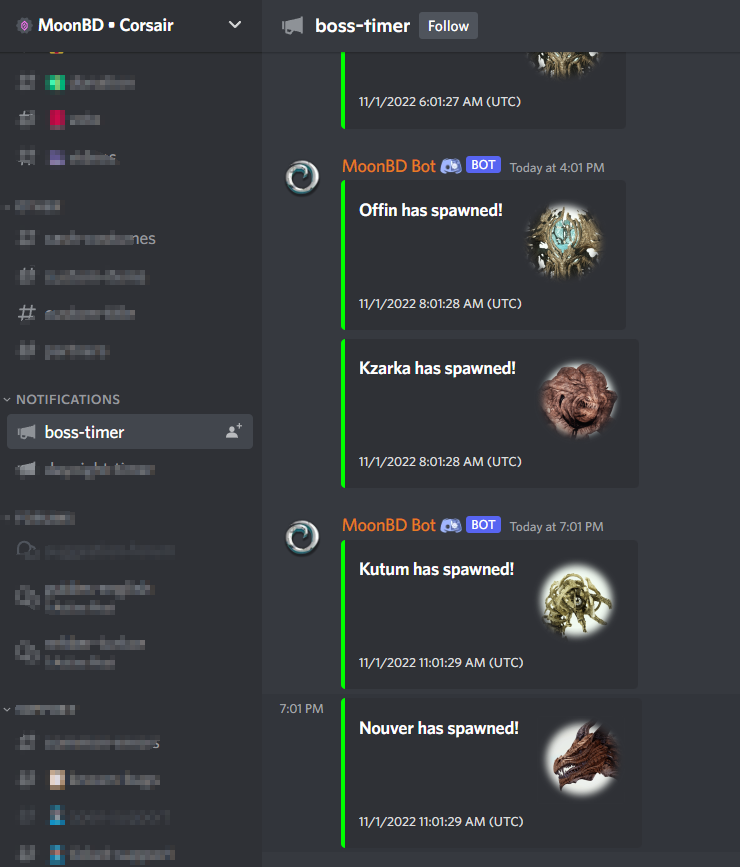
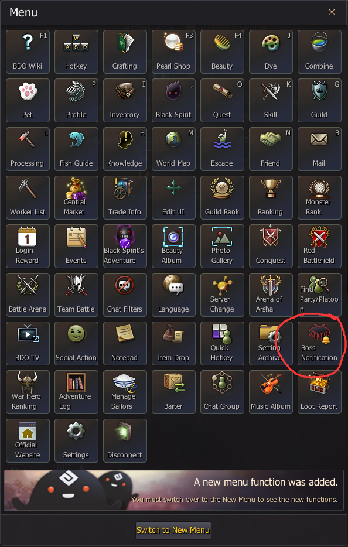
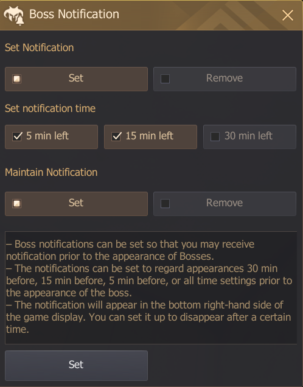
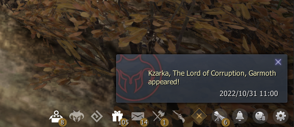
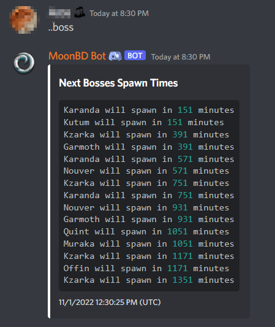

# 📅 Boss Calendar


1 to 5 minutes difference may occur because of server restarts.



Bosses are unkillable most of time, a world boss takes 30 mins to despawn and a field boss takes 15 mins to despawn and drop loot.


### _Boss Calendar Spreadsheet_

> _You can check the boss calendar in the google spreadsheet._


Boss Calendar Spreadsheet


### _Discord Boss Timer Channel_

> You can check Discord **#boss-timer** channel for notifications.

<figure><figcaption></figcaption></figure>

### _In Game Boss Notification_

> You can enable the _Boss Notification_ function to get notified before the boss spawns.

<figure><figcaption>
<strong>Select in the ESC menu</strong>
</figcaption></figure>

<figure><figcaption>
<strong>Configure to your like</strong>
</figcaption></figure>

<figure><figcaption>
<strong>Get notified when/before bosses spawn</strong>
</figcaption></figure>

### _Discord Bot Command_

> Use `..boss` command in MoonBD discord for boss timer.

<figure><figcaption></figcaption></figure>
