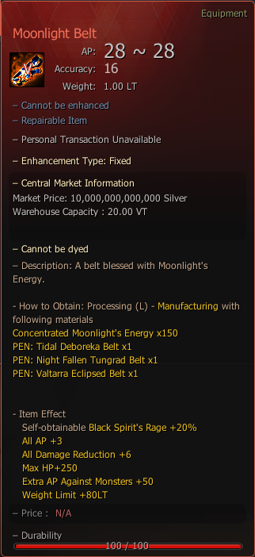

# Moonlight Belt

## _Crafting Recipe_


**How to Obtain**: Processing (L) -  **Manufacture** With Following Materials



To reform your accessory to "Tidal" or "Nightfallen" [Visit Here](../../custom-tools-recipes/accessory-reform-item.md).


| Item                                                                                                                      | Quantity |
| ------------------------------------------------------------------------------------------------------------------------- | -------- |
| .png>) PEN: [Tidal Deboreka Belt](https://bdocodex.com/us/item/12277/#5)             | 1        |
|  PEN: [Nightfallen Tungrad Belt](https://bdocodex.com/us/item/12272/#5)              | 1        |
|  PEN: [Valtarra Eclipsed Belt](https://bdocodex.com/us/item/12236/#5)                | 1        |
|  [Concentrated Moonlight's Energy](concentrated-moonlights-energy.md) | 150      |

<figure><figcaption>
Moonlight Belt
</figcaption></figure>
