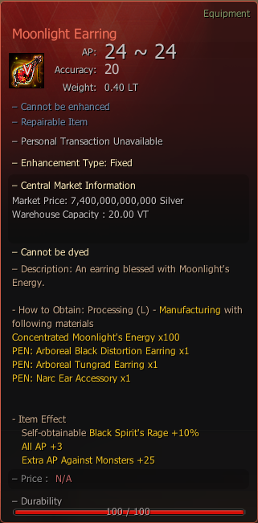

# Moonlight Earring

## _Crafting Recipe_


**How to Obtain**: Processing (L) - Manufacture With Following Materials



To reform your accessory to "Arboreal" [Visit Here](../../custom-items-recipes/accessory-change-item.md).


| Item                                                                                                                                                 | Quantity |
| ---------------------------------------------------------------------------------------------------------------------------------------------------- | -------- |
|  PEN: [Arboreal Distortion Earring](https://bdocodex.com/us/item/11871/#5)                                     | x 1      |
|  PEN: [Arboreal Tungrad Earring](https://bdocodex.com/us/item/550904/#5)                                       | x 1      |
|  PEN: [Narc Ear Accessory](https://bdocodex.com/us/item/550802/#5)                                             | x 1      |
|  [Concentrated Moonlight's Energy](../../custom-items-recipes/concentrated-moonlights-energy.md) | x 100    |

<figure><figcaption>
Moonlight Earring
</figcaption></figure>
