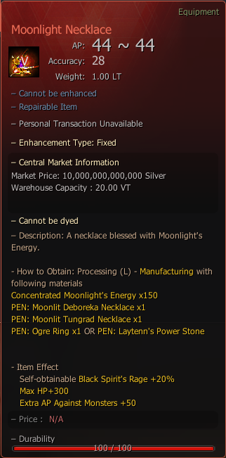

# Moonlight Necklace

## _Crafting Recipe_


**How to Obtain**: Processing (L) - Manufacture With Following Materials



To reform your accessory to "Moonlit" [Visit Here](../../custom-items-recipes/accessory-change-item.md).


| Item                                                                                                                                                                                                       | Quantity |
| ---------------------------------------------------------------------------------------------------------------------------------------------------------------------------------------------------------- | -------- |
|  PEN: [Moonlit Deboreka Necklace](https://bdocodex.com/us/item/11669/#5)                                                                                              | x 1      |
|  PEN: [Moonlit Tungrad Necklace](https://bdocodex.com/us/item/11667/#5)                                                                                              | x 1      |
|  PEN: [Ogre Ring](https://bdocodex.com/us/item/11607/#5) or  PEN: [Laytenn's Power Stone](https://bdocodex.com/us/item/11630/#5) | x 1      |
|  [Concentrated Moonlight's Energy](../../custom-items-recipes/concentrated-moonlights-energy.md)                                                       | x 150    |

<figure><figcaption>
Moonlight Necklace
</figcaption></figure>

>

