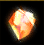
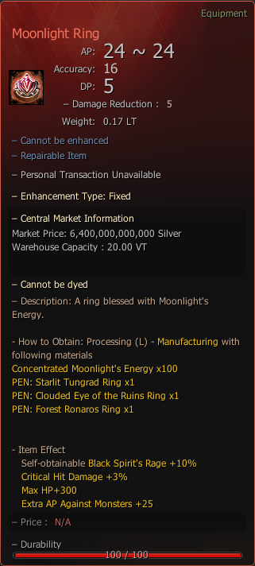

# Moonlight Ring

## _Crafting Recipe_


**How to Obtain**: Processing (L) - Manufacture With Following Materials



To reinform your accessory to "Starlit" or "Clouded" [Visit Here](../../custom-items-recipes/accessory-change-item.md).


| Item                                                                                                                                                 | Quantity |
| ---------------------------------------------------------------------------------------------------------------------------------------------------- | -------- |
| PEN: [Starlit Tungrad Ring](https://bdocodex.com/us/item/12085/#5)                                                                                   | x 1      |
| PEN: [Clouded Eye of the Ruins Ring](https://bdocodex.com/us/item/12077/#5)                                                                          | x 1      |
| PEN: [Forest Ronaros Ring](https://bdocodex.com/us/item/12042/#5)                                                                                    | x 1      |
|  [Concentrated Moonlight's Energy](../../custom-items-recipes/concentrated-moonlights-energy.md) | x 100    |

<figure><figcaption>
Moonlight Ring
</figcaption></figure>

