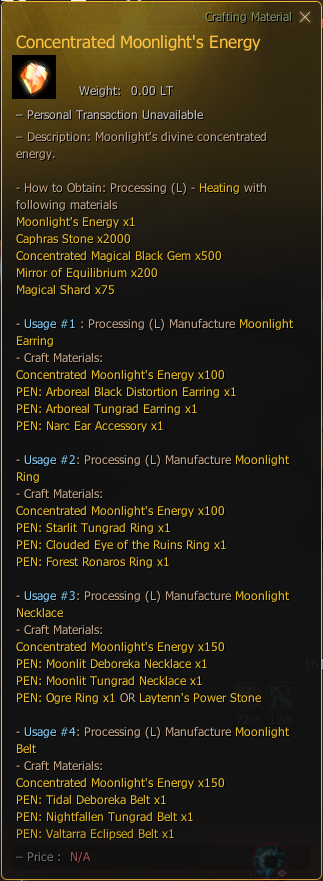

# Concentrated Moonlight's Energy

## _Recipe_


**How to Obtain**: Processing (L) - **Heating** With Following Materials


| Item                                                                                         | Quantity |
| -------------------------------------------------------------------------------------------- | -------- |
|  Magical Shard                              | 75       |
|  Mirror of Equilibrium                      | 200      |
|  Caphras Stone                              | 2000     |
|  Concentrated Magical Black Gem             | 500      |
|  [Moonlight's Energy](moonlights-energy.md) | 1        |

<figure><figcaption></figcaption></figure>
