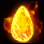

# \[Hunting] Guru Matchlock

### _Recipe_

| Item                                                                             | Qty   |
| -------------------------------------------------------------------------------- | ----- |
|  Breath of Narcion              | 100   |
|  Magical Shard                  | 100   |
|  Caphras Stone                  | 25000 |
|  Concentrated Magical Black Gem | 5000  |
|  \[Hunting] Master Matchlock+10 | 1     |


**How to Obtain**: Processing (L) - **Manufacture** With Following Materials


<figure><figcaption></figcaption></figure>
