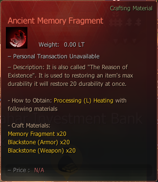

# Ancient Memory Fragment

> Ancient Memory Fragment can repair 20 durability per use.

### _Recipe_


**How to Obtain**: Processing (L) -  **Heating** With Following Materials


|                                                                        | Qty |
| ---------------------------------------------------------------------- | --- |
|  Memory Fragment      | 20  |
|  Black Stone (Armor)  | 20  |
|  Black Stone (Weapon) | 20  |

<figure><figcaption></figcaption></figure>
