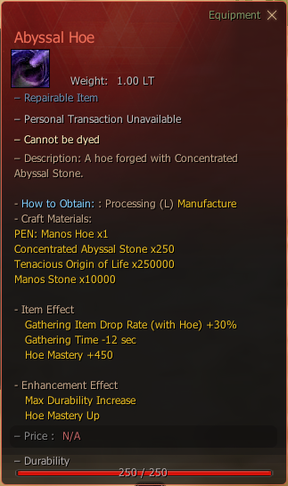

# Abyssal Hoe

## _Recipe_


**How to Obtain**: Processing (L) -  **Manufacture** With Following Materials



You can enhance this tool with [Concentrated Abyssal Stone](../materials/concentrated-abyssal-stone.md).


| Item                                                                                                               | Qty     |
| ------------------------------------------------------------------------------------------------------------------ | ------- |
|  PEN: Manos Hoe                                                | 1       |
|  [Concentrated Abyssal Stone](../materials/concentrated-abyssal-stone.md) | 250     |
|  [Manos Stone](https://bdocodex.com/us/item/4915/)                       | 10,000  |
|  [Tenacious Origin of Life](https://bdocodex.com/us/item/5303/)          | 250,000 |

<figure><figcaption></figcaption></figure>
