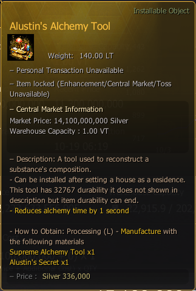

# Alustin's Alchemy Tool

> An ultimate alchemy tool with **32767** durability**.**

### _Recipe_


**How to Obtain**: Processing (L) -  **Manufacture** With Following Materials


| Item                                                                                                     | Qty |
| -------------------------------------------------------------------------------------------------------- | --- |
| **** **** Supreme Alchemy Tool                       | 1   |
|  [Alustin's Secret](../materials/alustins-secret.md) | 1   |

<figure><figcaption></figcaption></figure>
