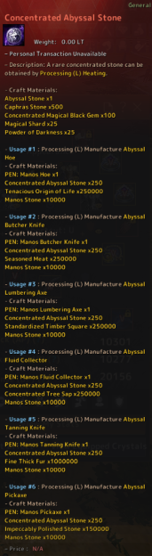

# Concentrated Abyssal Stone

## _Recipe_


1. This item is use to enhance the [Abyssal Life Tools](../life-tools/).
2. **How to Obtain**: Processing (L) -  **Heating** With Following Materials.


| Item                                                                                                                               | Qty |
| ---------------------------------------------------------------------------------------------------------------------------------- | --- |
|  [Abyssal Stone](abyssal-stone.md)                   | 1   |
|  Caphras Stone                                            | 500 |
|  Concentrated Magical Black Gem                           | 100 |
|  Magical Shards                                           | 25  |
|  [Powder of Darkness](https://bdocodex.com/us/item/4801/) | 100 |

<figure><figcaption></figcaption></figure>
