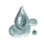
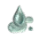
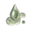
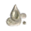
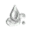
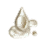
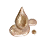

# Concentrated Tree Sap

### _Recipe_


**How to Obtain**: Processing (L) -  **Shaking** With **Any One** of the **** materials below.


| Item                                                                                      | Qty |
| ----------------------------------------------------------------------------------------- | --- |
|  Ash Sap         | 100 |
|  Maple Sap       | 100 |
|  Pine Sap        | 100 |
|  Birch Sap       | 100 |
|  Fir Sap         | 100 |
|  Cedar Sap       | 100 |
|  White Cedar Sap | 100 |
|  Acacia Sap      | 100 |
|  Elder Tree Sap  | 100 |
|  Palm Sap        | 100 |
|  Cactus Sap      | 100 |
|  Moss Tree Sap   | 100 |
|  Loopy Tree Sap  | 100 |
|  Thuja Sap       | 100 |
|  Thornwood Sap   | 100 |

