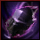

# Fughar Item Exchange


You can find Fughar in every city/town and exchange items with him.


> Fughar is your best friend.



| Items                                                                                                        |  Exchange For ↓                                                                            |
| ------------------------------------------------------------------------------------------------------------ | ------------------------------------------------------------------------------------------ |
|  Dragon Scale Fossil x 1000               |  Advice of Valks (+80)  |
|  Dragon Scale Fossil x 2500               |  Advice of Valks (+110) |
|  Black Stone (Armor) x 500                |  Advice of Valks (+40)  |
|  Black Stone (Armor) x 1000               |  Advice of Valks (+50)  |
|  Black Stone (Armor) x 1500               |  Advice of Valks (+60)  |
|  Black Stone (Weapon) x 500               |  Advice of Valks (+40)  |
|  Black Stone (Weapon) x 1000              |  Advice of Valks (+50)  |
|  Black Stone (Weapon) x 1500              |  Advice of Valks (+60)  |
|  Concentrated Magical Black Gem x 1500    |  Advice of Valks (+100) |
|  Concentrated Magical Black Gem x 4000    |  Advice of Valks (+150) |
|  Red Seal x 80                            |  Advice of Valks (+80)  |
|  Red Seal x 110                           |  Advice of Valks (+100) |
|  Red Seal x 220                           |  Advice of Valks (+220) |
|  Resplendent Medal of Honor x 10          |  Advice of Valks (+100) |
|  Resplendent Medal of Honor x 60          |  Advice of Valks (+200) |
|  Resplendent Medal of Honor x 350         |  Advice of Valks (+400) |
|  Ancient Sherekhan's Panacea              |  Advice of Valks (+150) |
|  Ancient Ron's Tintinnabulum              |  Advice of Valks (+150) |
|  Ancient Ash Halfmoon Kagtunak            |  Advice of Valks (+150) |
|  Ancient Narc's Crimson Tear              |  Advice of Valks (+150) |
|  Ancient Markthanan's Gland               |  Advice of Valks (+150) |
|  Archaeologist's Map Piece                |  Advice of Valks (+130) |
|  Archaeologist's Map Piece                |  Advice of Valks (+130) |
|  Archaeologist's Map Piece                |  Advice of Valks (+130) |
|  Archaeologist's Map Piece                |  Advice of Valks (+130) |
|  Lafi Bedmountain's Upgrade Compass Parts |  Advice of Valks (+120) |
|  Lafi Bedmountain's Upgrade Compass Parts |  Advice of Valks (+170) |
|  Lafi Bedmountain's Upgrade Compass Parts |  Advice of Valks (+250) |



| Items                                                                |    |                                                                                              |
| -------------------------------------------------------------------- | -- | -------------------------------------------------------------------------------------------- |
| [Sharp Black Crystal Shard](https://bdocodex.com/us/item/4998/) x 10 | >> |  Valk's Cry x 1 |
| [Hard Black Crystal Shard](https://bdocodex.com/us/item/4997/) x 10  | >> |  Valk's Cry x 1 |
| [Laila's Petal](https://bdocodex.com/us/item/54031/) x 10            | >> |  Valk's Cry x 1 |



| Items                                                                                                 |    |                                |
| ----------------------------------------------------------------------------------------------------- | -- | ------------------------------ |
|  Remnant of the Rift x 3 | >> | Blackstar Helmet               |
|  Remnant of the Rift x 3 | >> | Blackstar Armor                |
|  Remnant of the Rift x 3 | >> | Blackstar Gloves               |
|  Remnant of the Rift x 3 | >> | Blackstar Shoes                |
|  Remnant of the Rift x 4 | >> | Blackstar Main Weapon Box      |
|  Remnant of the Rift x 4 | >> | Blackstar Awakening Weapon Box |
|  Remnant of the Rift x 4 | >> | Blackstar Sub Weapon Box       |
|  Quturan's Left Lung x 1                                                                              | >> | La Orzeca Helmet Box           |
|  Quturan's Right Lung x 1                                                                             | >> | La Orzeca Armor Box            |



| Items                            |   |                                       |
| -------------------------------- | - | ------------------------------------- |
| Rift's Fragment x 5              | > | Rift's Echo                           |
| Manshaum Voodoo Dool             | > | Narc Magic Sealing Stone Bundle       |
| Garmoth's Scale                  | > | Dragon Scale Fossil                   |
| Fairy Powder x 100               | > | Restores 3 Energy                     |
| Fairy Powder x 600               | > | Restores 20 Energy                    |
| Red Seal x 1                     | > | Caphras Stone Bundle                  |
| Red Seal x 80                    | > | Main Weapon Exchange Coupon           |
| Red Seal x 80                    | > | Awk Weapon Exchange Coupon            |
| Red Seal x 80                    | > | Sub-Weapon Exchange Coupon            |
| Red Seal x 30                    | > | Remnants of the Rift                  |
| Red Seal x 50                    | > | Rebellious Spirit Crystal             |
| Caphras Stone x 5000             | > | Black Spirit Crystal                  |
| Golen's Heart Fragment x 300     | > | Black Essence                         |
| Abyssal Ash x 1000               | > | Red Essence                           |
| Tuvala Ore x 3000                | > | Supreme Alchemy Tool                  |
| Tuvala Ore x 3000                | > | Supreme Cooking Utensil               |
| Mysterious Catalyst x 200        | > | Supreme Alchemy Tool                  |
| Witch's Delicacy x 200           | > | Supreme Cooking Utensil               |
| Mystical Spirit Powder x 10      | > | Alchemy Stone Shard                   |
| Sea Monster's Spirit Pouch x 20  | > | Starlight Powder                      |
| Resplendent Medal of Honor x 50  | > | Black Magic Crystal - Carnage         |
| Resplendent Medal of Honor x 100 | > | \[Guild]Registration: Cadria Elephant |
| Resplendent Medal of Honor x 20  | > | Ancient Spirit's Crystal - Swiftness  |
| Resplendent Medal of Honor x 20  | > | Ancient Spirit's Crystal - Valor      |
| Resplendent Medal of Honor x 20  | > | Ancient Spirit's Crystal - Viper      |
| Resplendent Medal of Honor x 2   | > | Blue Whale Oil                        |
| Resplendent Medal of Honor x 2   | > | Blue Whale Tendon                     |
| Resplendent Medal of Honor x 2   | > | Fugitive Khalk's Skin                 |
| Resplendent Medal of Honor x 2   | > | Fugitive Khalk's Horn                 |
| Resplendent Medal of Honor x 1   | > | \[Event] Caphras Stone Bundle         |
| Caphras Stone x 200              | > | Kydict's Heirloom x 1                 |



| Items                                                                    |    |                     |
| ------------------------------------------------------------------------ | -- | ------------------- |
| Pearl Box - 80 x 10                                                      | >> | Pearl Box - 800 x 1 |
| [Sharp Horn](https://bdocodex.com/us/item/7759/) x 80                    | >> | Pearl Box - 80 x 1  |
| [Sharp Tooth](https://bdocodex.com/us/item/7762/) x 80                   | >> | Pearl Box - 80 x 1  |
| [Supreme Whole Leather](https://bdocodex.com/us/item/7756/) x 80         | >> | Pearl Box - 80 x 1  |
| [Large Beak](https://bdocodex.com/us/item/7765/) x 80                    | >> | Pearl Box - 80 x 1  |
| [Large Elephant Ivory](https://bdocodex.com/us/item/7768/) x 80          | >> | Pearl Box - 80 x 1  |
| [Full Five-Color Ferri Feather](https://bdocodex.com/us/item/7771/) x 80 | >> | Pearl Box - 80 x 1  |


