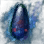
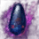

# Fughar Item Exchange


You can find Fughar in every city/town and exchange items with him.


> Fughar is your best friend.



| Items                                                                                                        |  Exchange To ↓                                                                             |
| ------------------------------------------------------------------------------------------------------------ | ------------------------------------------------------------------------------------------ |
|  Dragon Scale Fossil x 1000               |  Advice of Valks (+80)  |
|  Dragon Scale Fossil x 2500               |  Advice of Valks (+110) |
|  Black Stone (Armor) x 500                |  Advice of Valks (+40)  |
|  Black Stone (Armor) x 1000               |  Advice of Valks (+50)  |
|  Black Stone (Armor) x 1500               |  Advice of Valks (+60)  |
|  Black Stone (Weapon) x 500               |  Advice of Valks (+40)  |
|  Black Stone (Weapon) x 1000              |  Advice of Valks (+50)  |
|  Black Stone (Weapon) x 1500              |  Advice of Valks (+60)  |
|  Concentrated Magical Black Gem x 1500    |  Advice of Valks (+100) |
|  Concentrated Magical Black Gem x 4000    |  Advice of Valks (+150) |
|  Red Seal x 80                            |  Advice of Valks (+80)  |
|  Red Seal x 110                           |  Advice of Valks (+100) |
|  Red Seal x 220                           |  Advice of Valks (+220) |
|  Resplendent Medal of Honor x 10          |  Advice of Valks (+100) |
|  Resplendent Medal of Honor x 60          |  Advice of Valks (+200) |
|  Resplendent Medal of Honor x 350         |  Advice of Valks (+400) |
|  Ancient Sherekhan's Panacea              |  Advice of Valks (+150) |
|  Ancient Ron's Tintinnabulum              |  Advice of Valks (+150) |
|  Ancient Ash Halfmoon Kagtunak            |  Advice of Valks (+150) |
|  Ancient Narc's Crimson Tear              |  Advice of Valks (+150) |
|  Ancient Markthanan's Gland               |  Advice of Valks (+150) |
|  Archaeologist's Map Piece                |  Advice of Valks (+130) |
|  Archaeologist's Map Piece                |  Advice of Valks (+130) |
|  Archaeologist's Map Piece                |  Advice of Valks (+130) |
|  Archaeologist's Map Piece                |  Advice of Valks (+130) |
|  Lafi Bedmountain's Upgrade Compass Parts |  Advice of Valks (+120) |
|  Lafi Bedmountain's Upgrade Compass Parts |  Advice of Valks (+170) |
|  Lafi Bedmountain's Upgrade Compass Parts |  Advice of Valks (+250) |



| Items                                                                                              |    |   Exchange To ↓                                                                    |
| -------------------------------------------------------------------------------------------------- | -- | ---------------------------------------------------------------------------------- |
|  Sharp Black Crystal Shard x 10 | >> |  Valk's Cry x 1 |
|  Hard Black Crystal Shard x 10  | >> |  Valk's Cry x 1 |
|  Laila's Petal x 10             | >> |  Valk's Cry x 1 |



| Items                                                                                        |    |   Exchange To ↓                                                                                    |
| -------------------------------------------------------------------------------------------- | -- | -------------------------------------------------------------------------------------------------- |
|  Remnant of the Rift x 3  | >> |  Blackstar Helmet               |
|  Remnant of the Rift x 3  | >> |  Blackstar Armor                |
|  Remnant of the Rift x 3  | >> |  Blackstar Gloves               |
|  Remnant of the Rift x 3  | >> |  Blackstar Shoes                |
|  Remnant of the Rift x 4  | >> |  Blackstar Main Weapon Box      |
|  Remnant of the Rift x 4  | >> |  Blackstar Awakening Weapon Box |
|  Remnant of the Rift x 4  | >> |  Blackstar Sub Weapon Box       |
|  Quturan's Left Lung x 1  | >> |  La Orzeca Helmet Box           |
|  Quturan's Right Lung x 1 | >> |  La Orzeca Armor Box            |



| Items                                                                                                |   Exchange To ↓                                                                                             |
| ---------------------------------------------------------------------------------------------------- | ----------------------------------------------------------------------------------------------------------- |
|  Rift's Fragment x 5              |  Rift's Echo                             |
|  Manshaum Voodoo Doll             |  Narc Magic Sealing Stone Bundle         |
|  Garmoth's Scale                  |  Dragon Scale Fossil                     |
|  Fairy Powder x 100               |  Restores 3 Energy                 |
|  Fairy Powder x 600               |  Restores 20 Energy                |
|  Red Seal x 1                     |  Caphras Stone Bundle                    |
|  Red Seal x 80                    |  Main Weapon Exchange Coupon             |
|  Red Seal x 80                    |  Awk Weapon Exchange Coupon              |
|  Red Seal x 80                    |  Sub-Weapon Exchange Coupon              |
|  Red Seal x 30                    |  Remnants of the Rift                    |
|  Red Seal x 50                    |  Rebellious Spirit Crystal             |
|  Caphras Stone x 5000             |  Black Spirit Crystal                  |
|  Golem's Heart Fragment x 300     |  Black Essence                           |
|  Abyssal Ash x 1000               |  Red Essence                             |
|  Tuvala Ore x 3000                |  Supreme Alchemy Tool         |
|  Tuvala Ore x 3000                |  Supreme Cooking Utensil      |
|  Mysterious Catalyst x 200        |  Supreme Alchemy Tool         |
|  Witch's Delicacy x 200           |  Supreme Cooking Utensil      |
|  Mystical Spirit Powder x 10      |  Alchemy Stone Shard                     |
|  Sea Monster's Spirit Pouch x 20  |  Starlight Powder                        |
|  Resplendent Medal of Honor x 50  |  Black Magic Crystal - Carnage         |
|  Resplendent Medal of Honor x 100 |  \[Guild]Registration: Cadria Elephant   |
|  Resplendent Medal of Honor x 20  |  Ancient Spirit's Crystal - Swiftness |
|  Resplendent Medal of Honor x 20  |  Ancient Spirit's Crystal - Valor     |
|  Resplendent Medal of Honor x 20  |  Ancient Spirit's Crystal - Viper     |
|  Resplendent Medal of Honor x 2   |  Blue Whale Oil                          |
|  Resplendent Medal of Honor x 2   |  Blue Whale Tendon                       |
|  Resplendent Medal of Honor x 2   |  Fugitive Khalk's Skin                   |
|  Resplendent Medal of Honor x 2   |  Fugitive Khalk's Horn               |
|  Resplendent Medal of Honor x 1   |  \[Event] Caphras Stone Bundle           |
|   Caphras Stone x 200             |  Kydict's Heirloom x 1               |



| Items                                                                                                  |    |   Exchange To ↓                                                                     |
| ------------------------------------------------------------------------------------------------------ | -- | ----------------------------------------------------------------------------------- |
|  Pearl Box - 80 x 10                | >> |  Pearl Box - 800 |
|  Sharp Horn x 80                    | >> |  Pearl Box - 80  |
|  Sharp Tooth x 80                   | >> |  Pearl Box - 80  |
|  Supreme Whole Leather x 80         | >> |  Pearl Box - 80  |
|  Large Beak x 80                    | >> |  Pearl Box - 80  |
|  Large Elephant Ivory x 80          | >> |  Pearl Box - 80  |
|  Full Five-Color Ferri Feather x 80 | >> |  Pearl Box - 80  |


